# Hi there, I'm Linfeng Chen

## I'm a Husband, Father, Student and Developer!

- 🔭 Check out my Linkin Page: [Linkedin](https://www.linkedin.com/in/linfeng-chen-a73105244/)!
- 👀 Check out my Portfolio Page: [Linfeng Chen](https://linfeng.netlify.app/)!
- 🌱 I’m currently learning everything 🤣
- 👯 I’m looking to collaborate with Pro Coder
- 🥅 2022 Goals: Learn more about React
- ⚡ Fun fact: I love to and play Vedio Game
- 😻 Check out the other project I created: [Pokeman Go](https://github.com/danielchen2003/PokemanGoV1.0), [Yummy](https://github.com/danielchen2003/final-project-MERN-niu)
-

# The best photos App for your kids

# Niu-Niu

A Child photo Sharing and Storing App designed For Families

## Logo

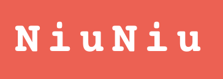
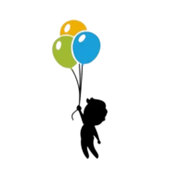

## Basic Features

1. Allow user search photos of kids.
2. Allow user to share photo of kids.
3. Allow user to update photo infomation.
4. Create/Delete your photo of your kids.
5. View other people's kids photo and hit a like button.
6. Browse kids photo from various countries.
7. Explore photo by location, age, name.
8. Perfect presentation of photo on the iphone and other smartphone screems.
9. Nice looking no match page with animation and pngs.
10. Receving Data from backend MongoDB API by Axios.
11. A sophisticated interface that can be adapted to multiple screen sizes and 2 media queries.

## Upcoming features

- Allow user to register as well as login through JWT.
- Get search result and load as fast as possible.
- Allow user to swtich between dark and light mode.

## Technology and Tools:

## WireFrames

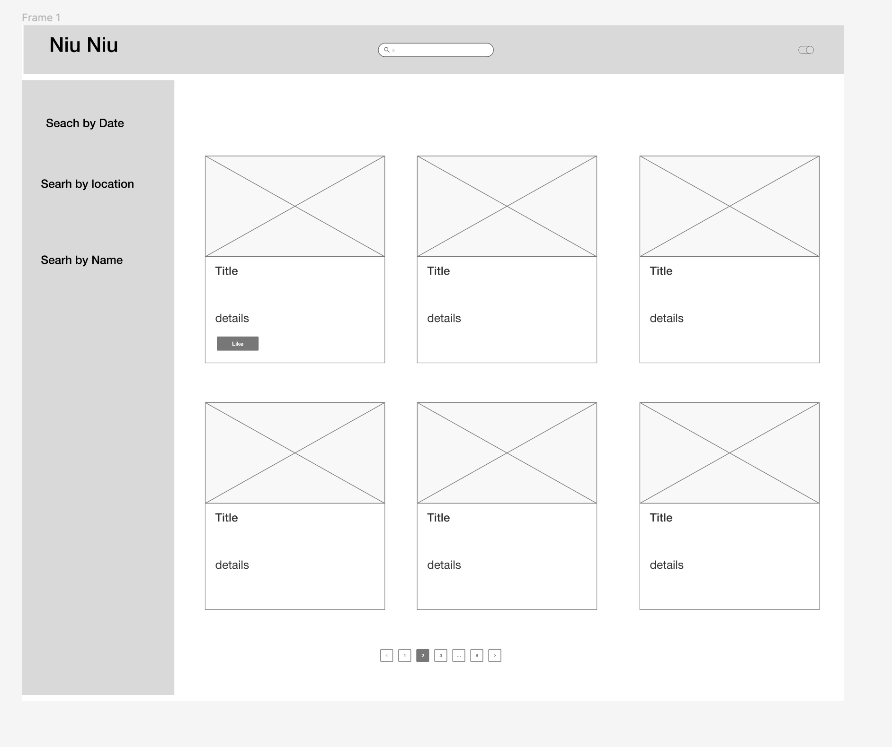

## Component hierarchy

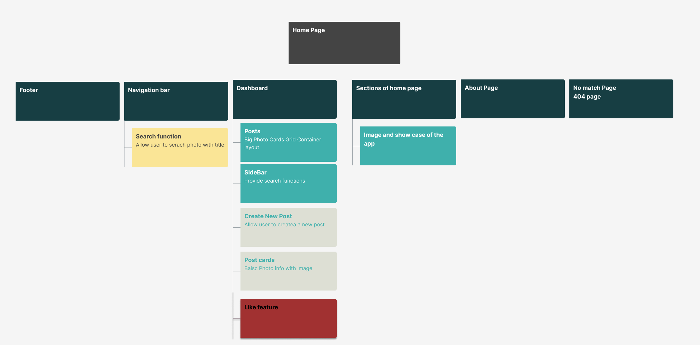

## Desktop ShowCase

<table>
  <tr>
     <td>Home Page Section 1</td>
      <td>Home Page Section 2</td>
 </tr>
 <tr>
    <td valign="top"></td>
    <td valign="top"></td>
 </tr>
 <tr>
     <td>Photo sharing page</td>
      <td>Photo Details page</td>
 </tr>
 <tr>
    <td valign="top">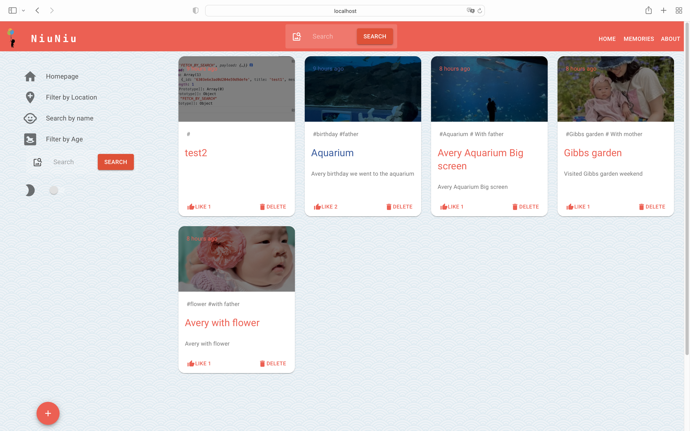</td>
    <td valign="top">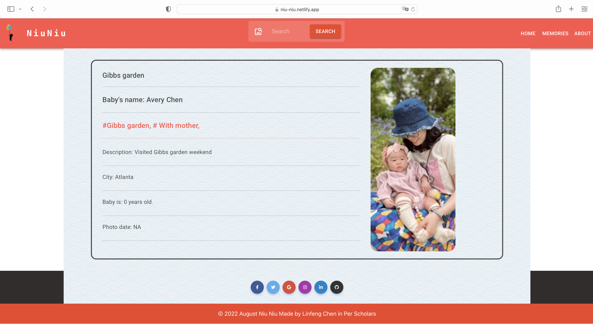</td>
 </tr>
 
 

## Resposive Iphone 12 responsive design to multiple devices

<table>
  <tr>
     <td>New Recipe Post Page</td>
     <td>My Favorites Page</td>
  </tr>
  <tr>
    <td valign="top">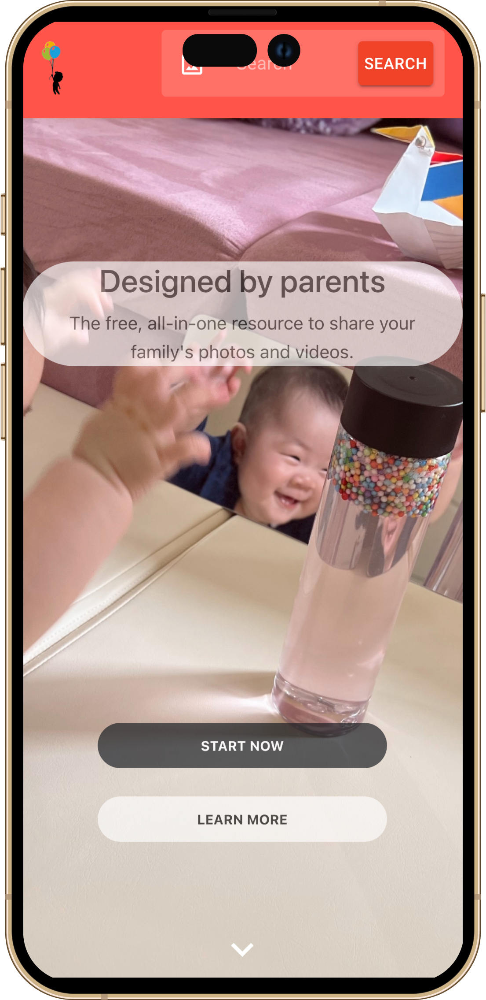</td>
    <td valign="top">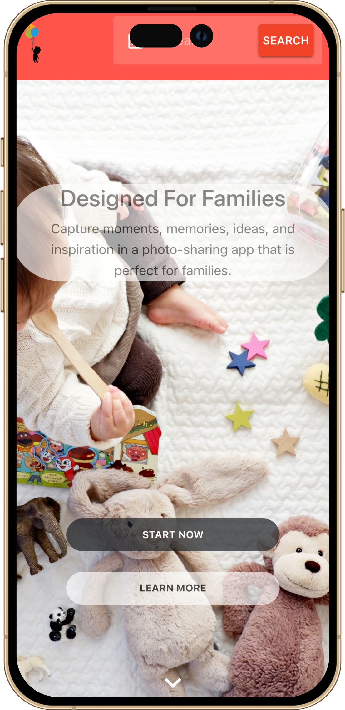</td>
 </tr>
  <tr>
     <td>Photo View</td>
     <td>About Page</td>
  </tr>
  <tr>
    <td valign="top">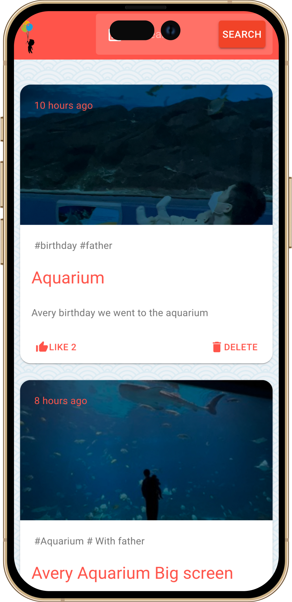</td>
    <td valign="top">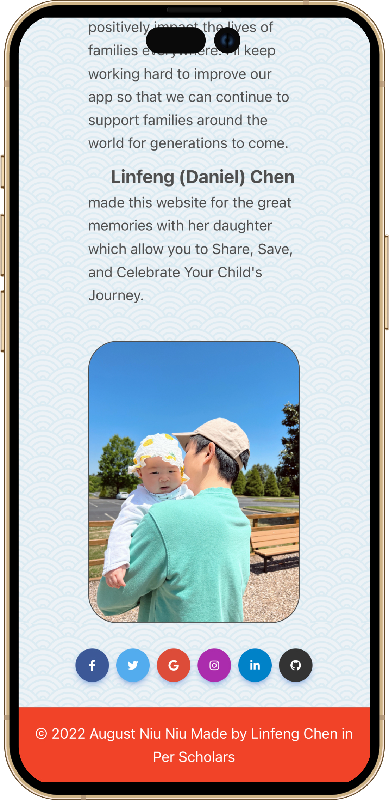</td>
    
  </tr>
  <tr>
     <td>Photo Details page</td>
     <td>Upload Recipt</td>
  </tr>
  <tr>
    <td valign="top">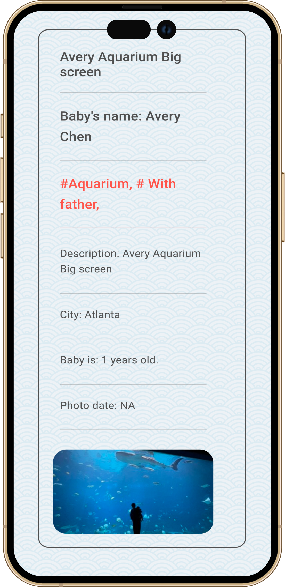</td>
    <td valign="top">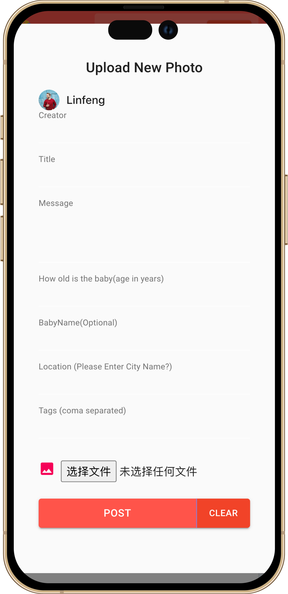</td>
    
  </tr>
  
  
## Others

<table>
  <tr>
     <td>No Match Page</td>
     </tr>`
     <tr>
    <td valign="top">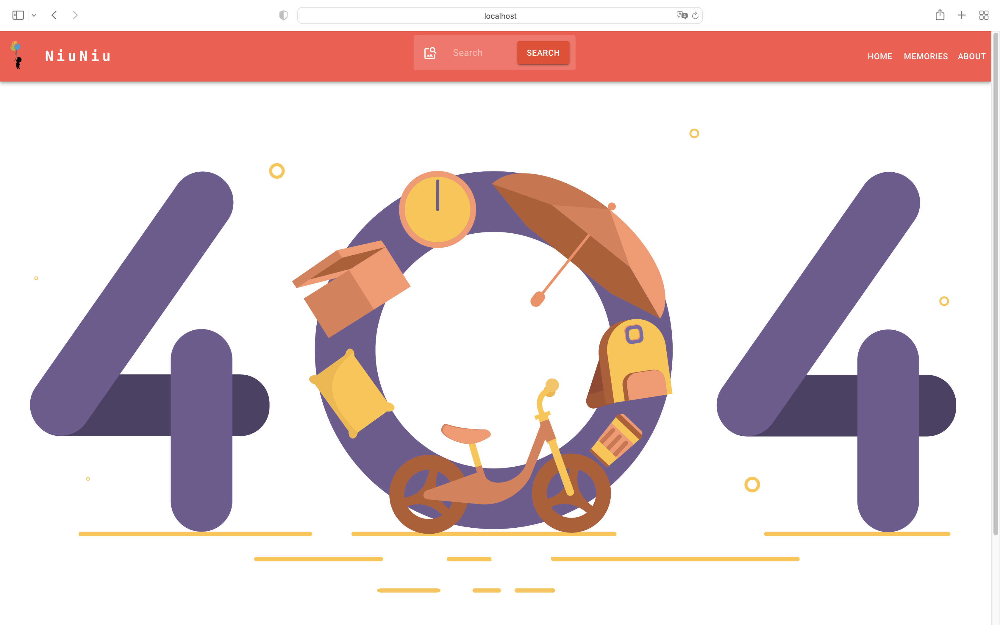</td>
    
  </tr>

# Languages

## Technologies Used

- React.js
- Javascript
- Material UI
- SCSS
- Css
- HTML
- Material Design
- NPM package
- Bootstrap 5
- Local storage
- Material Icons
- Axios
- Figma
- Prettier
- Redux

Usage is provided under the [MIT License](http://opensource.org/licenses/mit-license.php). See LICENSE for the full details.

<h3>Demo:https://niu-niu.netlify.app/</h3>

<h3 align="center">
  The best photos App for your kids
</h3>

  

  
  
  

  <a href="#computer-languages">Languages</a>   |   
  <a href="#books-technologies">Technologies</a>   |   
  <a href="#install">Install</a>   |   
  <a href="#books-usage">Usage</a>   |   
  <a href="#user-stories">User Stories</a>   

## Author

👤 **Linfeng Chen**

- Github: [@danielchen2003](https://github.com/danielchen2003)
